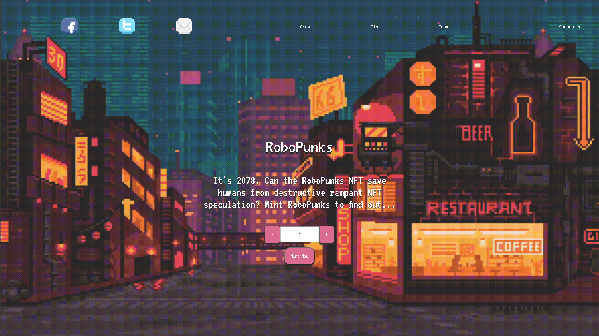
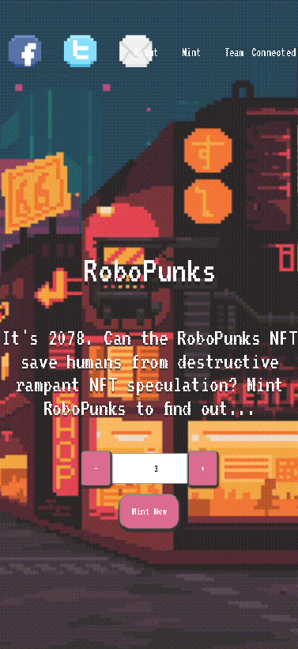

# RoboPunksNFT

    It's 2078. Can the RoboPunks NFT save humans from destructive rampant NFT speculation?

This project is developed for improving ERC721 NFT contracts, solidity, hardhat and openzeppelin

 

## Demo

[RoboPunksNFT.app](https://robo-punks-nft-git-master-emreaslan7.vercel.app/)

| Desktop | Mobile |
| --- | --- |
| |  |

 

## Tech Stack

  

 
 

## Environment Variables

To run this project you will need to add the following environment variables to your .env file

 

- `REACT_APP_GOERLI_URL`

- `REACT_APP_ETHERSCAN_API_KEY`

- `REACT_APP_PRIVATE_KEY`

 
 

## Feedback

You can share your feedback about the project with me. If you encounter any issues, please feel free to email me at:

- Email: emreaslan.eth@gmail.com

Thank you!
